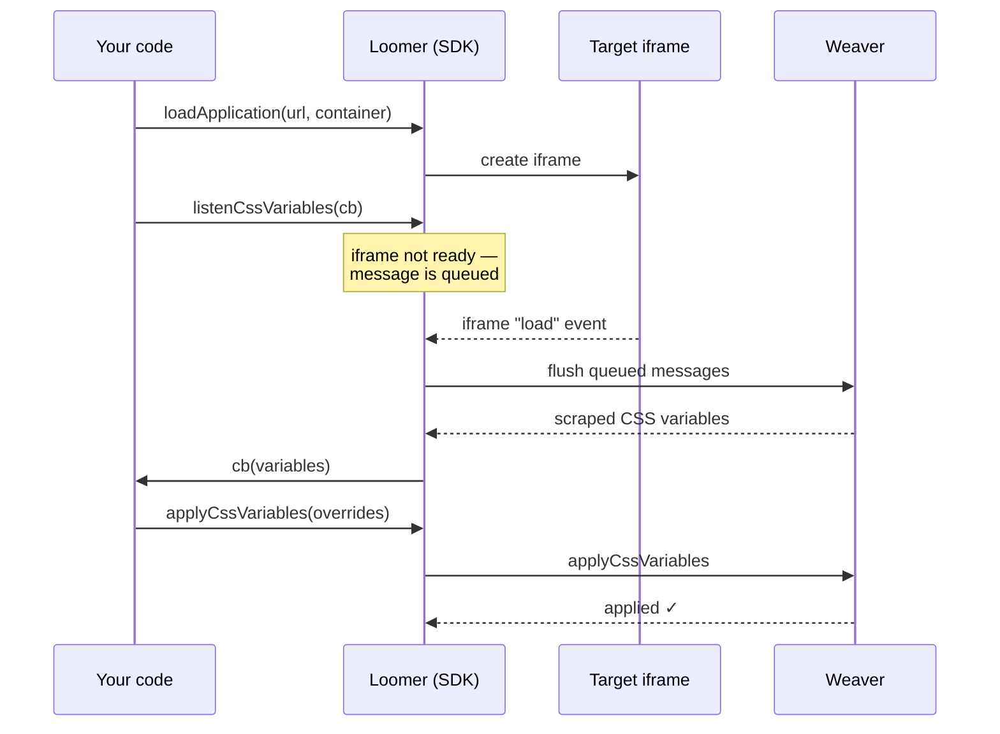

# @neomorph/sdk

The **headless, framework-agnostic** core of Neomorph. Use it to add live CSS-variable theming to your own product — load a target app, read its theme, write a new one.

The SDK has no UI of its own. [Neomorph Studio](../studio) is a visual designer built on top of this SDK; this package is what you reach for when you want to build that experience into your own app instead.

## What's in the box

The SDK exports two classes:

| Class | Side | Responsibility |
|---|---|---|
| `Loomer` | Designer side (parent window) | Loads a target app in an iframe and drives it: scrape variables, apply a theme, reset, configure, tear down. |
| `Weaver` | Designer side | One helper — injects the Weaver script into a page from the CDN. |

> **Naming note:** `Loomer` is the *controller class*. "Studio" is the separate ready-made *app*. You use `Loomer`; Studio uses it too.

The target app itself runs the [`@neomorph/weaver`](../weaver) script — that's a separate package, loaded inside the app being themed, not imported here.

## Installation

```bash
npm install @neomorph/sdk
```

Or load the CDN build, which exposes `window.Neomorph.Loomer` and `window.Neomorph.Weaver`.

## Prerequisites

The target app must theme itself with CSS custom properties (`--color-primary`, etc.) and must have the Weaver script loaded. See the [root README](../../README.md) for the full picture.

## Usage

### Load a target app and read its theme

```ts
import { Loomer } from '@neomorph/sdk';

const loomer = new Loomer();

// Creates an iframe for the target app inside the given container
loomer.loadApplication('https://your-app.com', document.getElementById('preview'));

// Ask the app for its CSS variables. The callback fires with the scraped
// data, and again every time the app's stylesheets change.
loomer.listenCssVariables((variables) => {
  console.log('current theme:', variables);
  // variables is keyed by host ("document", shadow-root tag names),
  // then by CSS selector, then a list of { property, value } pairs.
});
```

Messages are queued until the iframe finishes loading, so you can call these
immediately after `loadApplication` without waiting.

### Apply a theme

```ts
loomer.applyCssVariables(
  {
    document: {
      '--color-primary': '#e11d48',
      '--color-bg': '#0f172a'
    }
  },
  /* persist */ true
);
```

The outer key is the host (`'document'` or a shadow-root host's tag name). Pass
`persist: true` to save the theme to the target app's `localStorage` so it
survives reloads.

### Reset, configure, tear down

```ts
loomer.clearTheme();                       // remove overrides + clear persisted theme
loomer.configure({ debounceMs: 500 });     // tune Weaver's runtime behavior
loomer.teardown();                         // disconnect observers + listeners
```

### Inject the Weaver script programmatically

If you control the target page, you can inject Weaver instead of adding a `<script>` tag by hand:

```ts
import { Weaver } from '@neomorph/sdk';

Weaver.inject(); // appends the Weaver CDN script to document.head
```

## API reference

### `class Loomer`

| Method | Description |
|---|---|
| `loadApplication(url, container?)` | Create an iframe for `url` inside `container` (defaults to `document.body`). |
| `listenCssVariables(callback)` | Scrape the target's CSS variables; `callback` fires now and on every later change. |
| `applyCssVariables(variables, persist?)` | Apply CSS variable overrides. `persist` saves them to the target's `localStorage`. |
| `clearTheme()` | Remove all applied overrides and clear the persisted theme. |
| `configure(config)` | Update Weaver's runtime config (e.g. `debounceMs`, `hostFilter`). |
| `teardown()` | Disconnect Weaver's observers and listeners in the target app. |

### `class Weaver`

| Method | Description |
|---|---|
| `Weaver.inject(version?)` | Append the Weaver script (from jsDelivr) to `document.head`. Defaults to the latest pinned version. |

## How communication works

`Loomer` and the in-app Weaver script talk over the `postMessage` API. Every
message is JSON with a `skinweaver` service identifier and a `requestId`.
`Loomer` queues outgoing messages until the iframe's `load` event fires, then
flushes them — so ordering and timing are handled for you:



## Security notes

- **Origins** — messages are validated by service identifier. When embedding untrusted apps, also apply iframe `sandbox` attributes.
- **Exposure** — only CSS variables actually present in the target's stylesheets are visible; Weaver does not expose anything else.
- **Validation** — validate CSS values before calling `applyCssVariables` if they come from user input.

## License

ISC — see [LICENSE](../../LICENSE).
