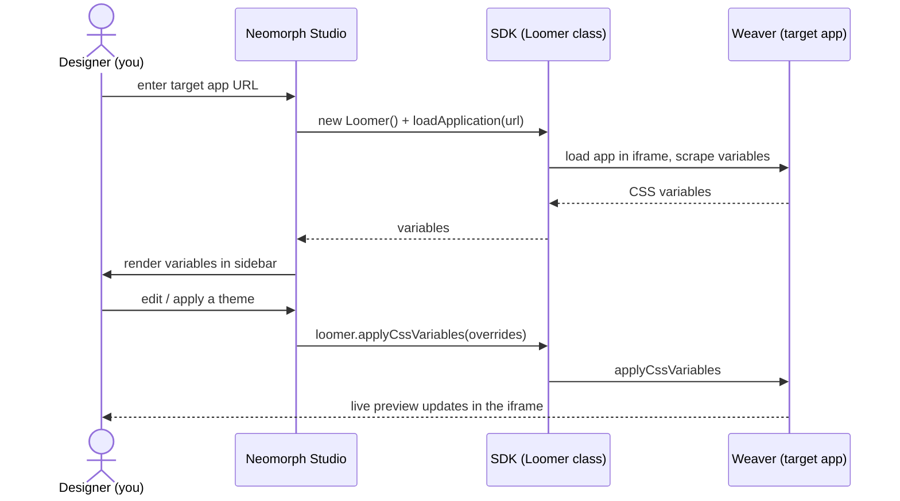

# @neomorph/studio

**Neomorph Studio** — a ready-made visual theme designer. Point it at any web app that runs the [Weaver](../weaver) script and edit that app's theme in a live split-view: preview on the left, CSS variables on the right.

Studio is a SvelteKit app built on top of [`@neomorph/sdk`](../sdk). It is one possible designer surface — if you want theming inside your _own_ product instead of a standalone app, use the SDK directly.

## What it does

- Loads a target app URL in an iframe (via the SDK's `Loomer` class)
- Scrapes and lists the app's CSS variables, grouped by host and selector
- Applies theme overrides live and resets them
- No build step or code needed from the person designing a theme — just a URL

## Running it

```bash
# from the repo root
pnpm dev:studio
```

Studio starts on **http://localhost:9900**.

You can pass the target app up front with a query parameter:

```
http://localhost:9900/?appUrl=http://localhost:3000
```

Otherwise Studio shows an onboarding screen to enter the URL.

### Trying it against the example app

```bash
pnpm build:weaver     # build the Weaver script Studio talks to
pnpm example          # serve the example target app on :3000
pnpm dev:studio       # run Studio on :9900
```

Open `http://localhost:9900/?appUrl=http://localhost:3000`.

## How it fits together

Studio holds no theming logic of its own — it's a UI over the SDK. The actual scraping and applying happens in Weaver, inside the target app:



## Commands

```bash
pnpm dev        # dev server (port 9900)
pnpm build      # production build
pnpm preview    # preview the production build
pnpm check      # type-check
pnpm lint       # lint
```

## License

ISC — see [LICENSE](../../LICENSE).
